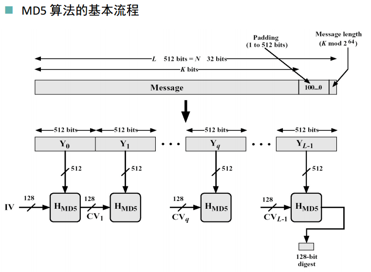
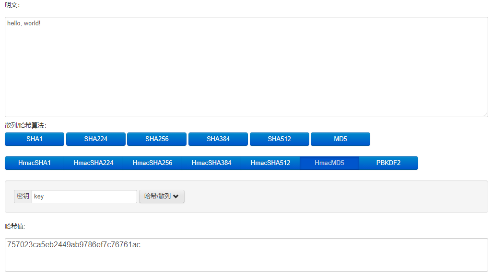
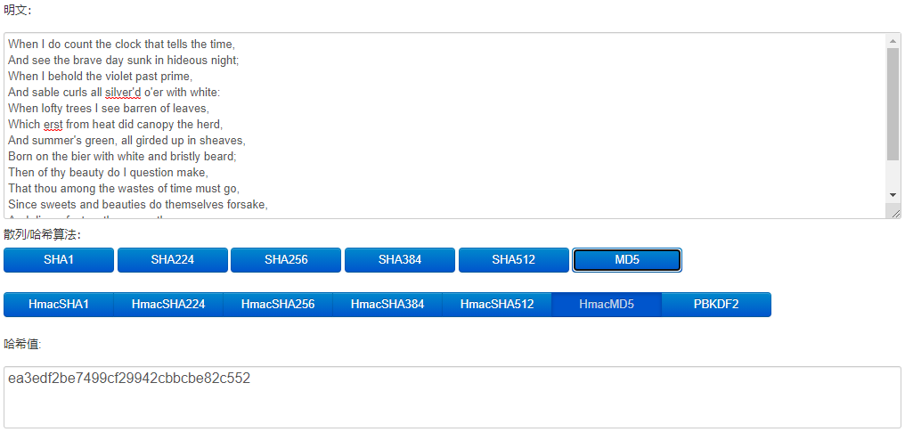
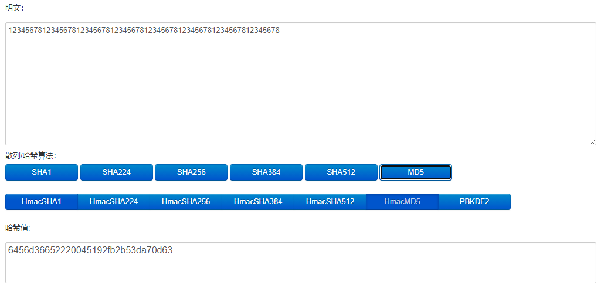
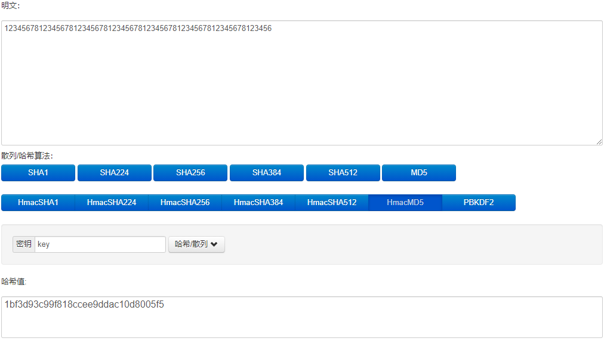

# C语言实现HMAC-MD5算法
学号：18342069

姓名：罗炜乐

[TOC]


## 使用方法
### 编译
```sh
cd hw3_HMAC-MD5 && make
```
### 使用MD5
```sh
./bin/hmac-md5 md5 input 
```

### 使用HMAC
```sh
./bin/hmac-md5 hmac input key
```

## 原理概述

### MD5

MD5 是信息摘要算法，用于确保消息传输的完整性和一致性。MD5 算法的基本过程为：填充、分块、缓冲区初始化、循环压缩、得出结果。  



#### 填充分块

- 一直读取 Message，每512 bits 划分成一个块 $Y_i$。
- Message 填充到最后一个块时，开始填充一个1，然后填充0。填充至少包括一个1，填充到一个块剩下64位。填充过程如果有需要则新增一个块。 
- 最后块的64位填充原始消息的位数。

#### 缓冲区初始化

每个带4个字节 (32-bit) 的4个寄存器构成向量 (A, B, C, D)，也称 MD 缓冲区。以下16进制初值作为 MD 缓冲区的初始向量 IV，并采用小端存储 (little-endian) 的储结构： 

 

#### 循环压缩

##### 总控流程

以512-bit 消息分组为单位，每一分组 $Y_{q}(q=0,1, \ldots, L-1)$ 经过4 个循环的压缩算法，表示为 :

 $
C V_{0}=I V，
C V_{i}=\mathrm{H}_{\mathrm{MDS}}\left(C V_{i-1}, Y_{i-1}\right), i=1, \ldots, L
$

输出结果 hash 值 : $M D=C V_{L}$.

##### MD5 压缩函数 $H_{MD5}$

- $\mathrm{H}_{\mathrm{MD} 5}$ 从 $\mathrm{CV}$ 输入128位, 从消息分组输入512位，完成4轮循环后，输出128位，作为用于下一轮输入的 $C V$ 值。
- 每轮循环分别固定不同的生 成函数 $F, G, H, I,$ 结合指定的 $T$ 表元素 $T[]$ 和消息分组的不同部分 $X[]$ 做16次迭代运算, 生成下一轮循环的输入。
- 4轮循环共有64次迭代运算。


- 4轮循环中使用的生成函数 $g$ (也称轮函数) 是一个32位非线性逻辑函数。同一轮循环的所有迭代使用相同的 $g$ 函数，而各轮循环对应的 $g$ 函数具有不同的定义：  
    $$
    \begin{array}{|c|l|l|}
    \hline \text { 轮次 } & \text { Function } g & g(b, c, d) \\
    \hline 1 & F(b, c, d) & (b \wedge c) \vee(\neg b \wedge d) \\
    \hline 2 & G(b, c, d) & (b \wedge d) \vee(c \wedge \neg d) \\
    \hline 3 & H(b, c, d) & b \oplus c \oplus d \\
    \hline 4 & l(b, c, d) & c \oplus(b \vee \neg d) \\
    \hline
    \end{array}
    $$

- 每轮循环中的一次迭代运算逻辑

    1. 对 $A$ 迭代 $: a \leftarrow b+((a+g(b, c, d)+X[k]+T[i])<<<s)$
    2.  缓冲区 $(A, B, C, D)$ 作循环置换 :$(B, C, D, A) \leftarrow(A, B, C, D)$

    说明:

    - $a, b, c, d: \mathrm{MD}$ 缓冲区 $(A, B, C, D)$ 的各个寄存器的当前值。 $g:$ 轮函数 $F, G, H, I$ 中的一个。 

    - $<<<s$ : 将32位输入循环左移 (CLS) $s$ 位; $s$ 为规定值。
    - $X[k]:$ 当前处理消息分组 $q$ 的第 $k$ 个 $(k=0 . .15)$ 32位字。如 果消息 $M$ 按32-bit 编址，即为 $M_{q \times 16+k}$
    -  $T[i]: T$ 表的第 $i$ 个元素, 32 位字 ; $T$ 表总共有64个元素, 也 称为加法常数。

    + +: 模 $2^{32}$ 加法。

+ 每轮循环中的一次迭代运算逻辑示意图  


- 各轮循环中第 $i$ 次迭代 $(i=1 . .16)$ 使用的 $X[k]$ 的确定 :
    设 $j=i-1:$

    - 第1轮迭代 $: k=j .$
        - 顺序使用 $X[0,1,2,3,4,5,6,7,8,9,10,11,12,13,14,15]$
    - 第2轮迭代 $: k=(1+5 j) \bmod 16 .$
        - 顺序使用 $\mathrm{X}[1,6,11,0,5,10,15,4,9,14,3,8,13,2,7,12]$
    - 第3轮迭代 $: k=(5+3 j) \bmod 16 .$
        - 顺序使用 $X[5,8,11,14,1,4,7,10,13,0,3,6,9,12,15,2]$
    - 第4轮迭代 : $k=7 j \bmod 16 $.
        - 顺序使用 $X[0,7,14,5,12,3,10,1,8,15,6,13,4,11,2,9]$

- $T$ 表的生成
    
- $T[i]=\operatorname{int}\left(2^{32} \times|\sin (i)|\right)$，$int$ 取整函数，$sin$ 正弦函数，以 $i$ 作为弧度输入。
    
- 各轮各次迭代运算 $(1 . .64)$ 采用的左循环移位的位数 $s$ 值 :
    $$
    \begin{array}{l}
    s[1 . .16]=\{7,12,17,22,7,12,17,22,7,12,17,22,7,12,17,22\} \\
    s[17 . .32]=\{5,9,14,20,5,9,14,20,5,9,14,20,5,9,14,20\} \\
    s[33 . .48]=\{4,11,16,23,4,11,16,23,4,11,16,23,4,11,16,23\} \\
    s[49 . .64]=\{6,10,15,21,6,10,15,21,6,10,15,21,6,10,15,21\}
    \end{array}
    $$

#### 得出结果

算法结束时，需要对32位寄存器 $A$ 的值按照 little-endian 转换成4个 字节，顺序输出其8个16进制数符号; 同样分别处理寄存器 $B, C, D$ 输出 MD5 值的其他24个16进制数符号。寄存器 $A, B, C, D$ 联合输 出的结果是32个16进制数符号 (每个16进制数符号占4 bits，共128 bits)。

### HMAC

#### 算法结构

- 对共享密钥 $k$ 左边补0，生成一个 $b$ 位的数据块 $K^{+} ;$  **纠错，在RFC2104标准中应该是在共享密钥 $k$ 后面补0，原文： append zeros to the end of K to create a B byte string (e.g., if K is of length 20 bytes and B=64, then K will be appended with 44 zero bytes 0x00)**
-  $K^{+}$ 与 $i p a d=00110110$ 作 XOR，生成 $b$ 位的 $S_{i} ;$ 
- 对 $\left(S_{i} \| M\right)$ 进行 hash 压缩 (例如 $\left.\mathrm{MD} 5\right),$ 得到 $\mathrm{H}\left(S_{i} \| M\right) ;$
-  $K^{+}$ 与 $opad=01011100$ 作 XOR，生成 $b$ 位的 $S_{\circ} ;$ 
- 对 $S_{o} \| H\left(S_{i} \| M\right)$ 进行 hash 压缩 (例如 MD5)，得到$H M A C_{K}=H\left(S_{0} \| H\left(S_{i} \| M\right)\right)$

#### 特征

- 可直接使用各种 Hash 算法 (例如 MD5、SHA-1 等)；
- 可使用将来的更加安全和更加快速的 Hash 算法；
- 保持原始 Hash 算法的性能；
- 密钥的使用简单；
- 与 Hash 函数有同等的安全性。  

## 总体结构设计

### 文件结构

```
hw3_HMAC-MD5
    |
    --- README.md
    |
    --- include
    |   |
    |   --- md5.h
    |   |
    |   --- hmac.h
    |
    --- src
    |   |
    |   --- md5.c
    |   |
    |   --- hmac.c
    |   |
    |   --- main.c
    |
    --- bin
        |
        --- hmac-md5


```

### 函数设计

本次项目主要使用的函数如下所示

1.  MD5 的哈希函数

    ```c
    /**
    * @brief MD5 哈希函数
    * @param message 需要进行哈希的字符串
    * @param message_len 需要进行哈希的字符串的长度
    * @param message_bytes_len 信息的字节数
    * @param message_block_bits_len 哈希函数所用信息块的比特数
    */
    void MD5(char *message, uint64_t message_len, uint8_t *result);
    ```

2. MD5 的压缩函数 $H_{MD5}$

    ```c
    /**
    * @brief HMD5 函数
    * @param cv HMD5 的CV输入
    * @param mb message block
    * @return 返回哈希后的CV结果
    */
    CV HMD5(CV cv, MB mb);
    ```

3.  $H_{MD5}$各轮迭代所需要的宏定义

    ```c
    #define F(b, c, d) ((b & c) | (~b & d))
    #define G(b, c, d) ((b & d) | (c & ~d))
    #define H(b, c, d) (b ^ c ^ d)
    #define I(b, c, d) (c ^ (b | ~d))
    #define CLS(x, s) ((x >> (32 - s)) | (x << s))
    ```

4. MD5 算法用于打印结果的函数

    ```c
    /**
    * @brief 把长度为16 bytes的缓冲区以16进制形式顺序打印出来
    * @param result MD5 哈希后的结果
    */
    void print_result(uint8_t * result);
    ```

5. HMAC 函数

    ```c
    /**
    * @brief HMAC 函数
    * @param H 用于 HMAC 的哈希函数
    * @param message 需要进行 HMAC 消息认证的信息
    * @param message_bytes_len 信息的字节数
    * @param message_block_bits_len 哈希函数所用信息块的比特数
    * @param key 共享密钥字符串
    * @param key_len 共享密钥长度
    * @param result HMAC 的结果，如果使用 MD5 算法则需要一个16bytes的缓冲区
    */
    void HMAC(void (*H)(char *, uint64_t, uint8_t *), char * message, uint64_t message_bytes_len, uint64_t message_block_bits_len, uint8_t * key, uint64_t key_len, uint8_t * result);
    ```

## 模块分解

由于本程序支持MD5和HMAC-MD5两种模式，因此在主函数中需要根据命令行参数来选择所调动的函数。主函数代码如下所示，一些读数据之类的代码被省略了。

```c
int main(int argc, char ** argv) {
    if (argc != 3 && !strcmp(argv[1], "md5") || argc != 4 && !strcmp(argv[1], "hmac")) {
        fprintf(stderr, "This app has two functions:\n");
        fprintf(stderr, "HMAC: ./hmac-md5 hmac inputfile keyfile\n");
        fprintf(stderr, "MD5: ./hmac-md5 md5 inputfile\n");
        exit(1);
    }
    if (!strcmp(argv[1], "md5")) {
        ......
        MD5(inputfile_buffer, inputfile_size, result);
		......
    }
    else {
		......
        HMAC(MD5, inputfile_buffer, inputfile_size, 512, keyfile_buffer, keyfile_size, result);
		......
    }
}
```

在HMD5中，填充块的过程较为复杂。

1. 把 Message 全部划分到512 bits 的块，先处理不需要填充的块
2. 再处理需要填充的块
    - 使用 Message 填充32位的 uint32_t，并在下一个 uint32_t 中填写1000....
    - Message 尾部填充不满32位，使用1000....填充满该 uint32_t
3. 判断该块是否还有64位的位置填充信息长度
    - 如果有，则在需要填写长度的64位前面继续填0，在块的最后填充长度。
    - 如果没有，则需要一直填0填到下一个块的最后64位，再把长度填入下一个块的最后64位中。

该函数的代码如下所示，该函数处理过程较长，以下代码省略了把 CV 转化为 字符串的部分，完整代码可直接看 md5.c 文件。

```c
/**
* @brief MD5 哈希函数
* @param message 需要进行哈希的字符串
* @param message_len 需要进行哈希的字符串的长度
* @param message_bytes_len 信息的字节数
* @param message_block_bits_len 哈希函数所用信息块的比特数
*/
void MD5(char message[], uint64_t message_len, uint8_t *result) {
    // 先处理不需要填充的块
    uint64_t non_flled_block_num = message_len / 64;
    CV cv = IV;
    for (int i = 0; i < non_flled_block_num; ++i) {
        MB mb;
        for (int j = 0; j < 16; ++j) {
            mb.x[j] = 0;
            for (int k = 3; k >= 0; --k) {
                mb.x[j] = mb.x[j] << 8;
                mb.x[j] |= (uint8_t)message[64 * i + 4 * j + k];
            }
        }
        cv = HMD5(cv, mb);
    }
    // 再处理需要填充的块
    MB mb;
    uint64_t message_bits = message_len * 8;
    uint64_t message_remain = message_len % 64;

    if (message_remain) {
        // 可以填满一整个x
        int i = 0;
        for (; i < message_remain / 4; ++i) {
            mb.x[i] = 0;
            for (int j = 3; j >= 0; --j) {
                mb.x[i] = mb.x[i] << 8;
                mb.x[i] |= (uint8_t)message[64 * non_flled_block_num + 4 * i + j];
            }
        }

        // 填不满一整个x，则补1000..。能填满则直接填1000....
        int bytes_remain = message_remain % 4;
        mb.x[i] = 0;
        for (int j = 3; j >= 0; --j) {
            mb.x[i] = mb.x[i] << 8;
            if (j > bytes_remain) {
                continue;
            }
            else if (j == bytes_remain) {
                mb.x[i] |= 0x00000080;
            }
            else {
                mb.x[i] |= (uint8_t)message[64 * non_flled_block_num + 4 * i + j];
            }
        }
        ++i;
        // 判断该块是否还有位置填充信息长度
        // 如果有
        if (i <= 14) {
            for (; i < 14; ++i) {
                mb.x[i] = 0;
            }
            mb.x[15] = message_bits >> 32;
            mb.x[14] = message_bits & (uint32_t)0xffffffff;
            cv = HMD5(cv, mb);
        }
        // 如果没有则需要新增一个块
        else {
            for (; i < 16; ++i) {
                mb.x[i] = 0;
            }
            cv = HMD5(cv, mb);
            for (int i = 0; i < 14; ++i) {
                mb.x[i] = 0;
            }
            mb.x[14] = message_bits & (uint32_t)0xffffffff;
            mb.x[15] = message_bits >> 32;
            cv = HMD5(cv, mb);
        }
    }
    else {
        mb.x[0] = 0x00000080;
        for (int i = 1; i < 14; ++i) {
            mb.x[i] = 0;
        }
        mb.x[14] = message_bits & (uint32_t)0xffffffff;
        mb.x[15] = message_bits >> 32;
        cv = HMD5(cv, mb);
    }
	// 省略了把 CV 转化为 字符串的部分，完整代码可直接看 md5.c 文件。
}
```

MD5 中依赖  $H_{MD5}$ 压缩函数

1. $H_{MD5}$ 根据不同的轮次对$CV$选择不同的$F、G、H、I、X[]$
2. 交替$A,B,C,D$的顺序
3. 加到原来的$CV$上。

```c
/**
* @brief HMD5 函数
* @param cv HMD5 的CV输入
* @param mb message block
* @return 返回哈希后的CV结果
*/
CV HMD5(CV cv, MB mb) {
    CV origin_cv = cv;
    for (int i = 0; i < 4; ++i) {
        for (int j = 0; j < 16; ++j) {
            switch (i)
            {
            case 0:
                cv.a = cv.b + CLS((cv.a + F(cv.b, cv.c, cv.d) + mb.x[j] + T[i * 16 + j]), S[i * 16 + j]);
                break;
            case 1:
                cv.a = cv.b + CLS((cv.a + G(cv.b, cv.c, cv.d) + mb.x[(1 + 5 * j) % 16] + T[i * 16 + j]), S[i * 16 + j]);
                break;
            case 2:
                cv.a = cv.b + CLS((cv.a + H(cv.b, cv.c, cv.d) + mb.x[(5 + 3 * j) % 16] + T[i * 16 + j]), S[i * 16 + j]);
                break;
            case 3:
                cv.a = cv.b + CLS((cv.a + I(cv.b, cv.c, cv.d) + mb.x[(7 * j) % 16] + T[i * 16 + j]), S[i * 16 + j]);
                break;
            default:
                break;
            }
            uint32_t temp = cv.d;
            cv.d = cv.c;
            cv.c = cv.b;
            cv.b = cv.a;
            cv.a = temp;
        }
    }
    cv.a += origin_cv.a;
    cv.b += origin_cv.b;
    cv.c += origin_cv.c;
    cv.d += origin_cv.d;
    return cv;
}
```

print_result 用于打印结果

```c
/**
* @brief 把长度为16 bytes的缓冲区以16进制形式顺序打印出来
* @param result MD5 哈希后的结果
*/
void print_result(uint8_t * result) {
    for (int i = 0; i < 16; ++i) {
        printf("%02x", result[i]);
    }
    printf("\n");
}
```

HMAC 函数

- 对共享密钥 $k$ 左边补0，生成一个 $b$ 位的数据块 $K^{+} ;$  **纠错，在RFC2104标准中应该是在共享密钥 $k$ 后面补0，原文： append zeros to the end of K to create a B byte string (e.g., if K is of length 20 bytes and B=64, then K will be appended with 44 zero bytes 0x00)**
-  $K^{+}$ 与 $i p a d=00110110$ 作 XOR，生成 $b$ 位的 $S_{i} ;$ 
- 对 $\left(S_{i} \| M\right)$ 进行 hash 压缩 (例如 $\left.\mathrm{MD} 5\right),$ 得到 $\mathrm{H}\left(S_{i} \| M\right) ;$
-  $K^{+}$ 与 $opad=01011100$ 作 XOR，生成 $b$ 位的 $S_{\circ} ;$ 
- 对 $S_{o} \| H\left(S_{i} \| M\right)$ 进行 hash 压缩 (例如 MD5)，得到$H M A C_{K}=H\left(S_{0} \| H\left(S_{i} \| M\right)\right)$

```c
/**
* @brief HMAC 函数
* @param H 用于 HMAC 的哈希函数
* @param message 需要进行 HMAC 消息认证的信息
* @param message_bytes_len 信息的字节数
* @param message_block_bits_len 哈希函数所用信息块的比特数
* @param key 共享密钥字符串
* @param key_len 共享密钥长度
* @param result HMAC 的结果，如果使用 MD5 算法则需要一个16bytes的缓冲区
*/
void HMAC(void (*H)(char *, uint64_t, uint8_t *), char * message, uint64_t message_bytes_len, uint64_t message_block_bits_len, uint8_t * key, uint64_t key_len, uint8_t * result) {
    uint64_t message_block_bytes_len = message_block_bits_len / 8;
    // 生成K+
    uint8_t * k_plus = malloc(message_block_bytes_len);
    memset(k_plus + key_len, 0, message_block_bytes_len - key_len);
    memcpy(k_plus, key, key_len);
    // 生成Si和So
    uint8_t * si = malloc(message_block_bytes_len);
    uint8_t * so = malloc(message_block_bytes_len);
    for (int i = 0; i < message_block_bytes_len; ++i) {
        si[i] = k_plus[i] ^ ipad;
        so[i] = k_plus[i] ^ opad;
    }
    // 将Si和message拼接起来
    uint8_t * si_m = malloc(message_block_bytes_len + message_bytes_len);
    memcpy(si_m, si, message_block_bytes_len);
    memcpy(si_m + message_block_bytes_len, message, message_bytes_len);
    // 对拼接起来的 Si || message 进行第一次哈希
    (*H)(si_m, message_block_bytes_len + message_bytes_len, result);
    // 将 So 和第一次哈希结果拼起来
    uint8_t * so_h = malloc(message_block_bytes_len + 16);
    memcpy(so_h, so, message_block_bytes_len);
    memcpy(so_h + message_block_bytes_len, result, 16);
    // 对 So 和第一次哈希拼接结果进行第二次哈希
    (*H)(so_h, message_block_bytes_len + 16, result);
    free(k_plus);
    free(si);
    free(so);
    free(si_m);
    free(so_h);
}
```


## 数据结构设计

#### MD5

MD5部分主要是缓冲区，信息块，还有用于$H_{MD5}$的$T、S$。

```c
typedef struct MD5_CV
{
    uint32_t a;
    uint32_t b;
    uint32_t c;
    uint32_t d;
} CV;

typedef struct Message_Block
{
    uint32_t x[16];
} MB;

static const CV IV = {0x67452301, 0xEFCDAB89, 0x98BADCFE, 0x10325476};

static const uint32_t T[] = {
    0xd76aa478, 0xe8c7b756, 0x242070db, 0xc1bdceee,
    0xf57c0faf, 0x4787c62a, 0xa8304613, 0xfd469501,
    0x698098d8, 0x8b44f7af, 0xffff5bb1, 0x895cd7be,
    0x6b901122, 0xfd987193, 0xa679438e, 0x49b40821,
    0xf61e2562, 0xc040b340, 0x265e5a51, 0xe9b6c7aa,
    0xd62f105d, 0x02441453, 0xd8a1e681, 0xe7d3fbc8,
    0x21e1cde6, 0xc33707d6, 0xf4d50d87, 0x455a14ed,
    0xa9e3e905, 0xfcefa3f8, 0x676f02d9, 0x8d2a4c8a,
    0xfffa3942, 0x8771f681, 0x6d9d6122, 0xfde5380c,
    0xa4beea44, 0x4bdecfa9, 0xf6bb4b60, 0xbebfbc70,
    0x289b7ec6, 0xeaa127fa, 0xd4ef3085, 0x04881d05,
    0xd9d4d039, 0xe6db99e5, 0x1fa27cf8, 0xc4ac5665,
    0xf4292244, 0x432aff97, 0xab9423a7, 0xfc93a039,
    0x655b59c3, 0x8f0ccc92, 0xffeff47d, 0x85845dd1,
    0x6fa87e4f, 0xfe2ce6e0, 0xa3014314, 0x4e0811a1,
    0xf7537e82, 0xbd3af235, 0x2ad7d2bb, 0xeb86d391
};

static const uint32_t S[] = {
    7, 12, 17, 22, 7, 12, 17, 22, 7, 12, 17, 22, 7, 12, 17, 22,
    5,  9, 14, 20, 5,  9, 14, 20, 5,  9, 14, 20, 5,  9, 14, 20,
    4, 11, 16, 23, 4, 11, 16, 23, 4, 11, 16, 23, 4, 11, 16, 23,
    6, 10, 15, 21, 6, 10, 15, 21, 6, 10, 15, 21, 6, 10, 15, 21
};
```

#### HMAC

HMAC主要依赖于哈希函数，只有生成$K^+$的时候需要用到 $ipad,opad$

```c
static const uint8_t ipad = 0x36;
static const uint8_t opad = 0x5c;
```

## C语言源代码

可见压缩包的文件，此处不再浪费空间展示大段代码。

## 编译运行结果

### makefile

```makefile
CC=gcc
INC_DIR=include
SRC_DIR=src
BIN_DIR=bin
CFLAGS= -std=c99 -g
TARGET=hmac-md5

SOURCE_FILES=$(shell find $(SRC_DIR) -name '*.c')

$(BIN_DIR)/${TARGET}: $(SOURCE_FILES)
	mkdir -p $(BIN_DIR)
	$(CC) $(CFLAGS) -Iinclude $^ -o $@ -lm

.PHONY: clean
clean:
	rm -r bin
```

### 结果

```sh
[luowle@VM_0_4_centos hw3_HMAC-MD5]$ cat key
key
```

```sh
[luowle@VM_0_4_centos hw3_HMAC-MD5]$ cat input 
hello, world!
```

```sh
[luowle@VM_0_4_centos hw3_HMAC-MD5]$ make
mkdir -p bin
gcc -std=c99 -g -Iinclude src/main.c src/md5.c src/hmac.c -o bin/hmac-md5 -lm
[luowle@VM_0_4_centos hw3_HMAC-MD5]$ ./bin/hmac-md5 hmac input key 
757023ca5eb2449ab9786ef7c76761ac
[luowle@VM_0_4_centos hw3_HMAC-MD5]$ ./bin/hmac-md5 md5 input 
3adbbad1791fbae3ec908894c4963870
```

## 验证用例

[在线加密解密]( https://tool.oschina.net/encrypt?type=2)

使用的密钥统一为 key

```sh
[luowle@VM_0_4_centos hw3_HMAC-MD5]$ cat key
key
```

### 使用短文本

#### 输入文本

> hello, world!

#### 结果

```sh
[luowle@VM_0_4_centos hw3_HMAC-MD5]$ make
mkdir -p bin
gcc -std=c99 -g -Iinclude src/main.c src/md5.c src/hmac.c -o bin/hmac-md5 -lm
[luowle@VM_0_4_centos hw3_HMAC-MD5]$ ./bin/hmac-md5 hmac input key 
757023ca5eb2449ab9786ef7c76761ac
[luowle@VM_0_4_centos hw3_HMAC-MD5]$ ./bin/hmac-md5 md5 input 
3adbbad1791fbae3ec908894c4963870
```

#### 验证




### 使用长文本

#### 输入文本

使用莎士比亚十四行诗

> When I do count the clock that tells the time,
> And see the brave day sunk in hideous night;
> When I behold the violet past prime,
> And sable curls all silver'd o'er with white:
> When lofty trees I see barren of leaves,
> Which erst from heat did canopy the herd,
> And summer's green, all girded up in sheaves,
> Born on the bier with white and bristly beard;
> Then of thy beauty do I question make,
> That thou among the wastes of time must go,
> Since sweets and beauties do themselves forsake,
> And die as fast as they see others grow;
> And nothing 'gainst Time's scythe can make defence
> Save breed, to brave him when he takes thee hence.

#### 结果

```
[luowle@VM_0_4_centos hw3_HMAC-MD5]$ ./bin/hmac-md5 hmac input key 
d68376ba1ce2b9b5355fd94af28e221f
[luowle@VM_0_4_centos hw3_HMAC-MD5]$ ./bin/hmac-md5 md5 input 
ea3edf2be7499cf29942cbbcbe82c552
```

#### 验证




### 使用刚好为512 bits 的文本

此时需要扩展一个块用于填10000....

#### 输入文本

> 1234567812345678123456781234567812345678123456781234567812345678

#### 结果

```sh
[luowle@VM_0_4_centos hw3_HMAC-MD5]$ ./bin/hmac-md5 hmac input key 
0dacb95b3bf52358baa925b938a71428
[luowle@VM_0_4_centos hw3_HMAC-MD5]$ ./bin/hmac-md5 md5 input 
6456d36652220045192fb2b53da70d63
```

#### 验证




### 使用 Message 填到最后一个块大于448 bits 的文本

Message 填到最后一个块大于448 bits的文本，此时不足以填写 Message 的长度，需要扩展一个块。

#### 输入文本

> 12345678123456781234567812345678123456781234567812345678123456

#### 结果

```sh
[luowle@VM_0_4_centos hw3_HMAC-MD5]$ ./bin/hmac-md5 hmac input key 
1bf3d93c99f818ccee9ddac10d8005f5
[luowle@VM_0_4_centos hw3_HMAC-MD5]$ ./bin/hmac-md5 md5 input 
68a41e1d8b53303e1242ce9e359fea3c
```

#### 验证




